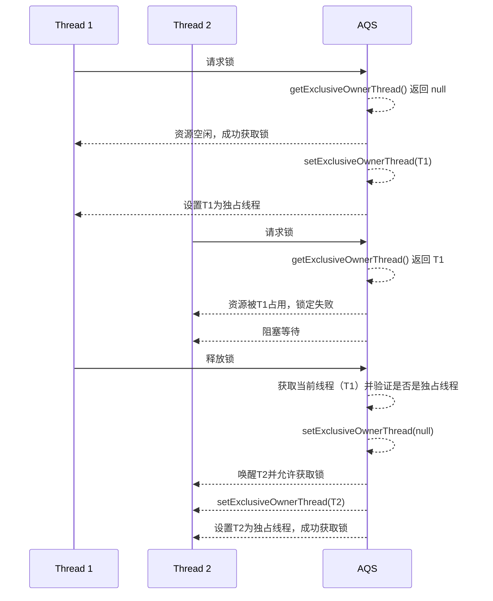
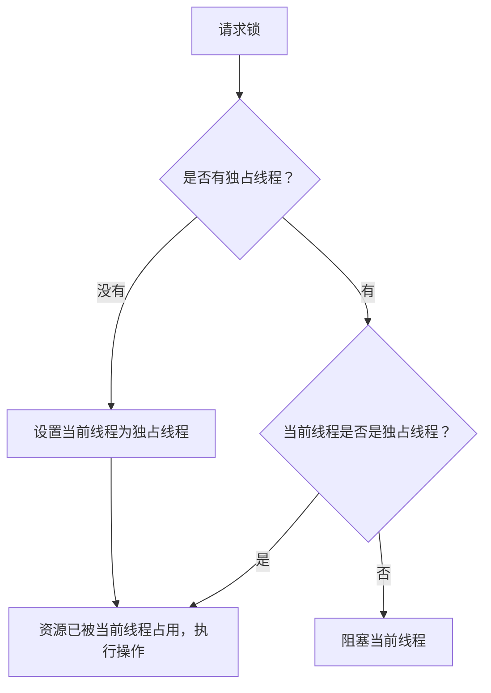
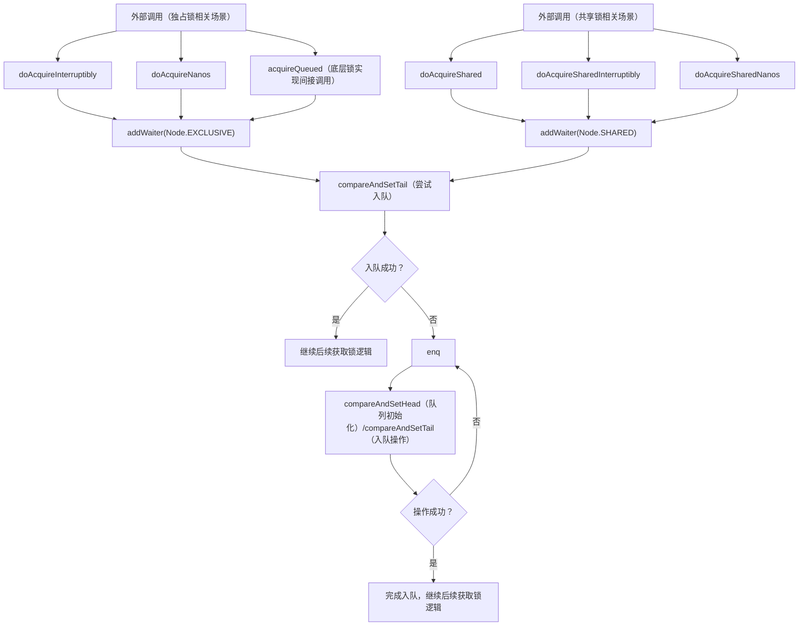
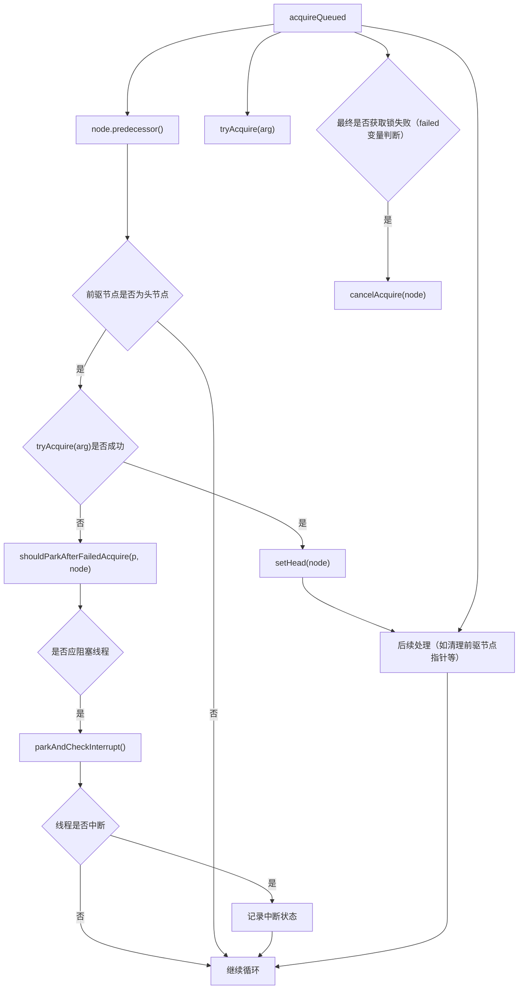
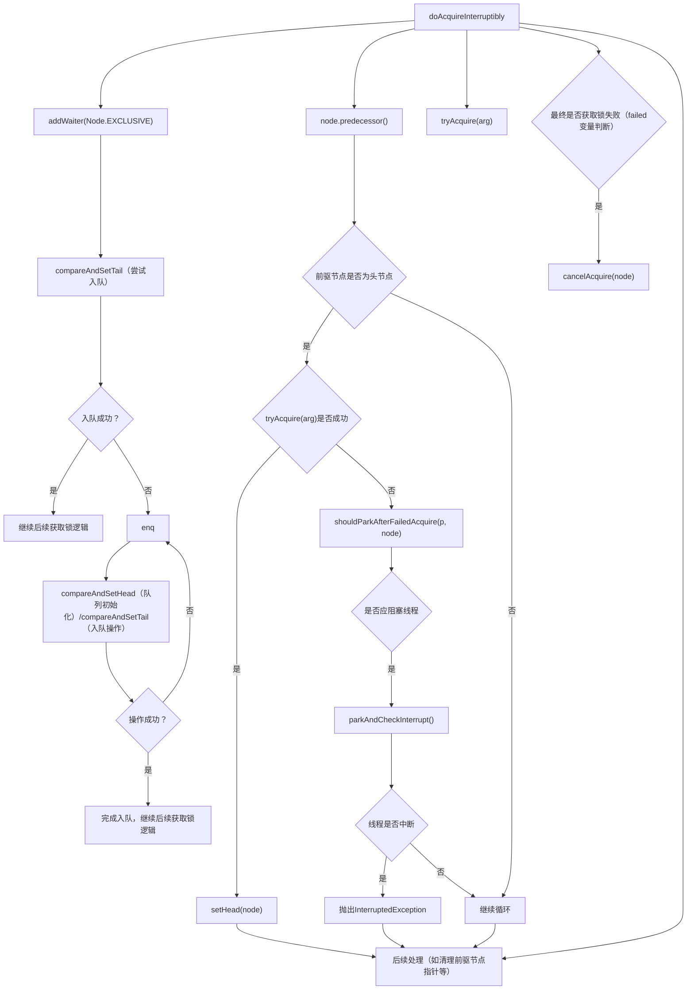
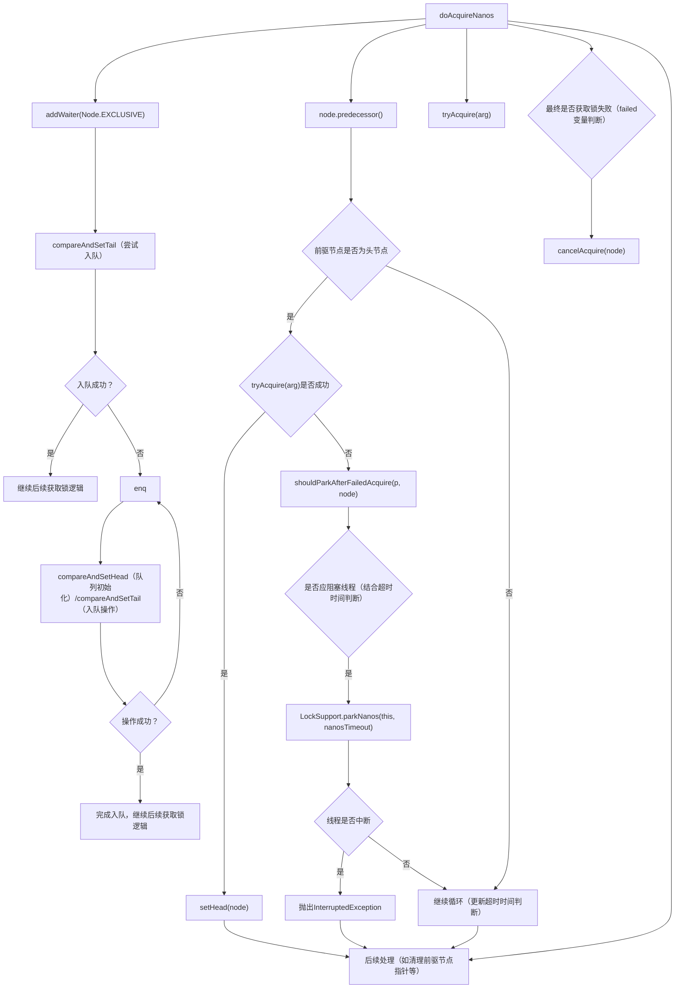
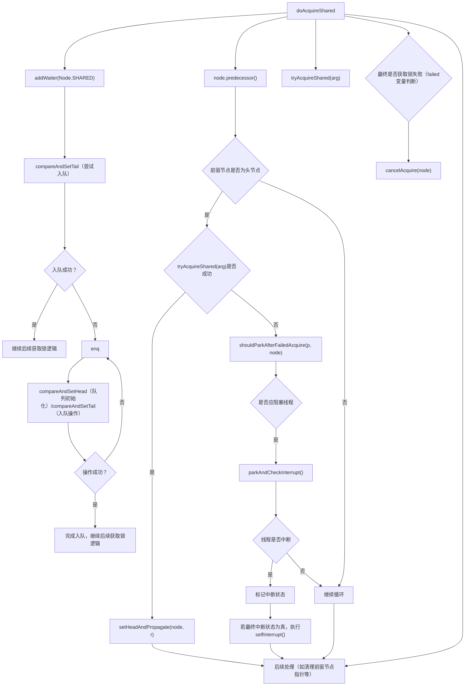
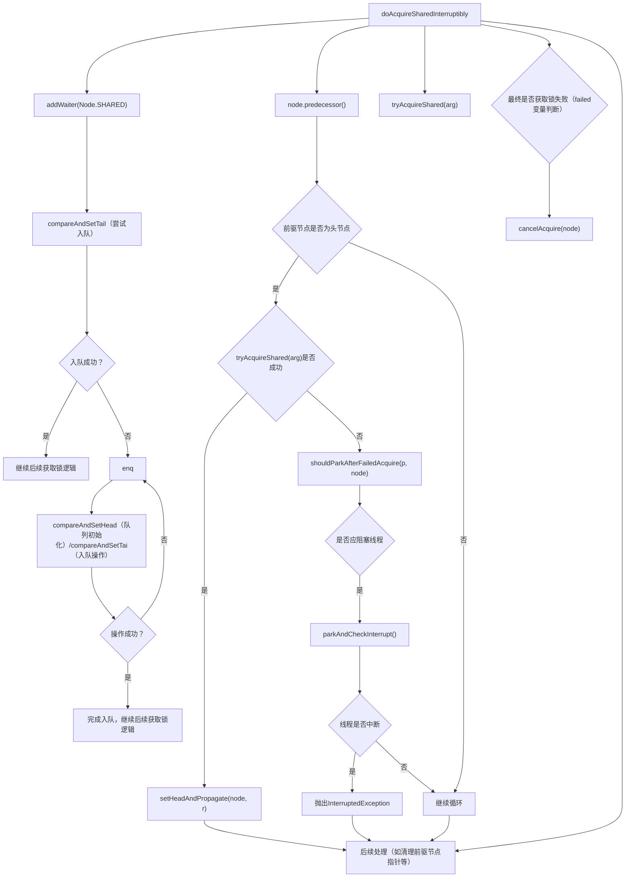
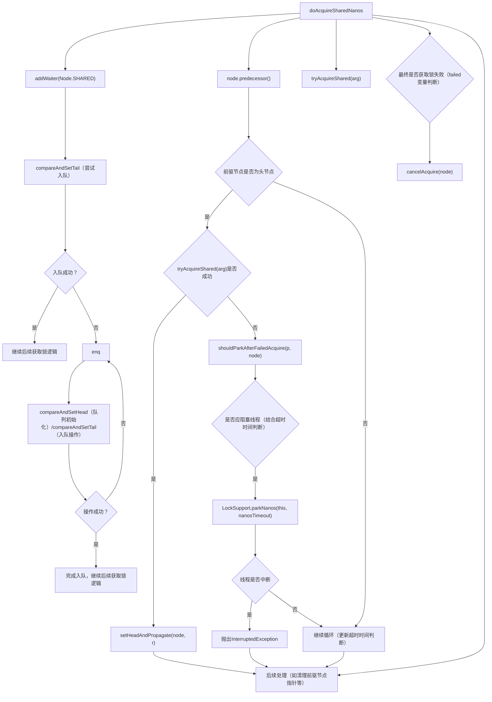

## 1. AQS 的概述

AbstractQueuedSynchronizer（AQS）是 Java 并发包中最精妙的设计之一，它提供了一个状态同步的通用框架，解决了并发编程中的线程协作问题。

AQS 内部维护一个共享**同步状态变量**和**线程等待队列**。如果被请求的**共享状态变量**空闲，那么就将当前请求资源的**线程**设置为有效的**工作线程**，将**共享状态变量**设置为锁定状态；如果**共享状态变量**被占用，就需要一定的阻塞等待唤醒机制来保证锁分配。这个机制主要用的是**CLH 队列**的变体实现的，将暂时获取不到锁的线程加入到**等待队列**中，待条件允许的时候将线程从队列中取出并进行唤醒。

## 2. 核心属性

### 2.1 同步状态变量管理

```java
// 同步状态，使用 volatile 修饰确保可见性
private volatile int state;

// 原子更新状态的关键方法
protected final boolean compareAndSetState(int expect, int update) {
    return unsafe.compareAndSwapInt(this, stateOffset, expect, update);
}
```

AQS 使用一个 32 位整型 `state` 来表示同步状态。

- 32 位足够表示复杂的同步场景。
- `volatile` 保证多线程可见性。
- CAS 操作确保线程安全的状态更新。

### 2.2 等待队列节点

```java
static final class Node {
    // 等待状态常量
    static final int CANCELLED =  1;   // 节点已取消
    static final int SIGNAL    = -1;   // 后继节点需要被唤醒
    static final int CONDITION = -2;   // 条件等待
    static final int PROPAGATE = -3;   // 共享模式状态传播

    // 节点关键属性
    volatile int waitStatus;        // 节点等待状态
    volatile Node prev;             // 前驱节点
    volatile Node next;             // 后继节点
    volatile Thread thread;         // 绑定线程
}
```

等待队列是一个双向链表，每个节点代表一个等待的线程。

- 线程状态通过 `waitStatus` 精确控制。
- 双向链表便于高效的节点操作。
- `volatile` 修饰保证线程间可见性。

### 2.3 两个队列

未完待续

## 3. 同步模式

AQS 提供两种同步模式：

### 3.1 独占模式（Exclusive）

```java
// 独占式获取同步状态
public final void acquire(int arg) {
    if (!tryAcquire(arg) &&
        acquireQueued(addWaiter(Node.EXCLUSIVE), arg))
        selfInterrupt();
}

// 独占式释放同步状态
public final boolean release(int arg) {
    if (tryRelease(arg)) {
        Node h = head;
        if (h != null && h.waitStatus != 0)
            unparkSuccessor(h);
        return true;
    }
    return false;
}
```

### 3.2 共享模式（Shared）

```java
// 共享模式获取同步状态
public final void acquireShared(int arg) {
    if (tryAcquireShared(arg) < 0)
        doAcquireShared(arg);
}

// 共享模式释放同步状态
public final boolean releaseShared(int arg) {
    if (tryReleaseShared(arg)) {
        doReleaseShared();
        return true;
    }
    return false;
}
```

## 4. 核心同步机制

### 4.1 节点入队

```java
private Node addWaiter(Node mode) {
    Node node = new Node(Thread.currentThread(), mode);
    Node pred = tail;
    if (pred != null) {
        node.prev = pred;
        if (compareAndSetTail(pred, node)) {
            pred.next = node;
            return node;
        }
    }
    enq(node);
    return node;
}
```

### 4.2 线程阻塞与唤醒

```java
final boolean acquireQueued(final Node node, int arg) {
    boolean failed = true;
    try {
        boolean interrupted = false;
        for (;;) {
            final Node p = node.predecessor();
            if (p == head && tryAcquire(arg)) {
                setHead(node);
                p.next = null;
                failed = false;
                return interrupted;
            }
            if (shouldParkAfterFailedAcquire(p, node) &&
                parkAndCheckInterrupt())
                interrupted = true;
        }
    } finally {
        if (failed)
            cancelAcquire(node);
    }
}
```

### 4.3 中断处理

```java
private void doAcquireInterruptibly(int arg) throws InterruptedException {
    final Node node = addWaiter(Node.EXCLUSIVE);
    boolean failed = true;
    try {
        for (;;) {
            final Node p = node.predecessor();
            if (p == head && tryAcquire(arg)) {
                setHead(node);
                p.next = null;
                failed = false;
                return;
            }
            if (shouldParkAfterFailedAcquire(p, node) &&
                parkAndCheckInterrupt())
                throw new InterruptedException();
        }
    } finally {
        if (failed)
            cancelAcquire(node);
    }
}
```

## 5. 高级特性

### 5.1 条件队列

```java
public final void await() throws InterruptedException {
    if (Thread.interrupted())
        throw new InterruptedException();
    Node node = addConditionWaiter();
    int savedState = fullyRelease(node);
    int interruptMode = 0;
    while (!isOnSyncQueue(node)) {
        LockSupport.park(this);
        if ((interruptMode = checkInterruptWhileWaiting(node)) != 0)
            break;
    }
    if (acquireQueued(node, savedState) && interruptMode != THROW_IE)
        interruptMode = REINTERRUPT;
    if (node.nextWaiter != null)
        unlinkCancelledWaiters();
    if (interruptMode != 0)
        reportInterruptAfterWait(interruptMode);
}
```

## 6. 优点

AQS 的性能优化体现在：

- 无锁化设计
- CAS 原子操作
- 精细的线程状态管理
- 最小化上下文切换

## 7. 源码分析

### 概览

| **层级**                   | **描述**                                                     | **关键方法/数据**                                            | **子类需要实现的方法**                                       | **简要说明**                                                 |
| -------------------------- | ------------------------------------------------------------ | ------------------------------------------------------------ | ------------------------------------------------------------ | ------------------------------------------------------------ |
| **第一层：对外暴露的 API** | AQS 提供给外部<br>同步器的接口，<br>用于加锁、解锁<br>等基本操作。 | -`acquire(int arg)` <br>- `release(int arg)`<br/>- `tryAcquire(int arg)` <br/>- `tryRelease(int arg)`<br/>- `acquireShared(int arg)` <br/>- `releaseShared(int arg)` <br/>- `isHeldExclusively()` | - `tryAcquire(int arg)` <br/>- `tryRelease(int arg)` <br/>- `acquireShared(int arg)` <br/>- `releaseShared(int arg)` | 这些方法为外部同步器<br>提供了基本功能，子类<br/>同步器需要重写相关的<br/>加锁和解锁操作。 |
| **第二层：锁获取**         | 实际的锁获取<br/>操作，通常通<br/>过 CAS 或自旋<br/>来尝试获取锁。 | - `tryAcquire(int arg)` <br/>-`acquireQueued(Node node, int arg)` <br/>- `isAcquiredQueued(Node node)` | - `tryAcquire(int arg)`                                      | 子类同步器需要实现如<br/>何尝试获取锁的逻辑。<br/>具体的实现方式依赖于<br/>同步器的策略。 |
| **第三层：等待队列处理**   | 处理获取锁失败<br/>时，线程如何进<br/>入等待队列并排队。     | - `addWaiter(Node.Mode mode)` <br/>- `cancelWaiter(Node node)` <br/>- `getWaitQueueLength(Node node)` <br/>- `hasQueuedThreads()` |                                                              | 子类需要实现将线程添加<br/>到等待队列、取消等待等<br/>队列管理的逻辑。 |
| **第四层：线程唤醒**       | 线程获取锁失败<br/>后，如何唤醒队<br/>列中的线程继续获取锁。 | - `unparkSuccessor(Node node)` <br/>- `signal(Node node)`    |                                                              | 负责唤醒排队的线程，确保<br/>线程按照公平或优先级的策<br/>略被唤醒，进入下一轮加锁争夺。 |
| **第五层：基础数据提供层** | 提供底层数据结构，<br/>管理锁状态、队列、节点等。            | - `state` - `head` 和 `tail` - `node` - `waitStatus`         |                                                              | 管理底层数据结构<br/>，确保锁的状态、队列的管理和同步数据的正确性。 |

```markdown
在 AQS 中，子类需要重写的主要方法如下：
1. tryAcquire(int acquires)
- 修饰符：protected
描述：用于尝试获取锁。
2. tryRelease(int releases)
修饰符：protected
描述：用于释放锁。
3. tryAcquireShared(int acquires)
修饰符：protected
描述：这是一个用于共享锁的获取方法。
4. tryReleaseShared(int releases)
修饰符：protected
描述：这是共享锁的释放方法。

-----------
其他：
5. isHeldExclusively()
修饰符：protected
描述：返回锁是否被当前线程独占。
6. hasQueuedThreads()
修饰符：public
描述：检查是否有线程在等待队列中。
7. getFirstQueuedThread()
修饰符：protected
描述：获取队列中的第一个等待线程。
```

### **为什么需要同步和同步器**

#### 1. **保证数据一致性**

在多线程环境中，多个线程可能会同时访问和修改共享的数据，容易导致数据的不一致。**同步机制**可以确保同一时刻**只有一个线程**对**共享资源**进行修改，从而避免数据竞争和冲突。（画外之音：**多线程中**只有**一个**线程**有权**对**共享资源**进行修改）

**举例**：假设有两个线程同时修改一个共享变量 `counter`，如果没有同步机制，可能会发生丢失更新（Lost Update）问题，即两个线程的更新操作会覆盖对方的修改，导致最终的结果不符合预期。

#### 2. **确保线程的协调与通信**

同步器允许**线程之间**协调和通信，以便在**适当的时候**启动某些任务或**进行**   **数据交换**。例如，在并行计算中，需要确保某些线程完成任务后，其他线程才能继续执行。同步器可以帮助线程按顺序执行任务，协调任务之间的依赖关系。（画外之音：**线程之间**有**通信需求**。）

**举例**：使用 `CountDownLatch` 来等待多个线程完成后，再执行后续操作。比如在一个网络请求的场景中，所有的请求都需要并行执行，但只有所有请求都完成后，才会执行后续的合并数据操作。

### **如何实现这两点？**

- **如何确保多线程中只有一个线程有权修改共享资源？**

首先，我们需要设计一个字段，来标识“**只有一个线程**有权对共享资源进行修改”，这个字段可以命名为 `exclusiveOwnerThread`。每次线程请求资源时，都会先检查这个字段，确认是否自己是该资源的“独占者”。

于是我们有了如下的同步器设计，它是通过一个标记 `exclusiveOwnerThread` 来管理资源的所有权。

```java
class AbstractQueuedSynchronizer {

    // 存储当前拥有锁的线程
    private transient Thread exclusiveOwnerThread;

    // 设置当前独占线程
    void setExclusiveOwnerThread(Thread thread) {
        exclusiveOwnerThread = thread;
    }

    // 获取当前独占线程
    protected final Thread getExclusiveOwnerThread() {
        return exclusiveOwnerThread;
    }
    
     public boolean tryAcquire(int acquires) {
        if (exclusiveOwnerThread==null) {
            // 成功获取锁
            setExclusiveOwnerThread(Thread.currentThread());
            return true;
        }
        return false;
    }

    // 释放锁
    public boolean tryRelease(int releases) {
        if (Thread.currentThread()==exclusiveOwnerThread) {
            // 释放锁
            setExclusiveOwnerThread(null);
            return true;
        }
        return false;
    }

}
```

在上面的设计中，**每次线程请求资源时，都会调用 `getExclusiveOwnerThread()` 来检查自己是否是该资源的拥有者**。如果是，则可以修改资源；如果不是，则会根据 `exclusiveOwnerThread` 是否为空来判断是否有其他线程持有资源。如果 `exclusiveOwnerThread` 为空，则当前线程会设置为资源的拥有者。如果已经有线程持有资源，则当前线程会被阻塞，直到资源被释放。





上面的实现方式存在一个问题：**修改`exclusiveOwnerThread`字段本身也会涉及到同步操作**，而这个操作本身可能会被其他线程打断，从而引发线程安全问题。为了解决这个问题，我们有以下两种方案：

- **悲观锁（synchronized）**：使用 `synchronized` 来确保只有一个线程能够访问 `exclusiveOwnerThread` 字段，这种方法会引入性能开销，因为每次操作都需要获得锁。
- **乐观锁（CAS）**：使用 `exclusiveOwnerThread` 进行 CAS（Compare And Swap）操作，这样就能确保只有一个线程能够成功更新该字段，但它依赖于硬件支持和 JVM 的优化。(低情商：硬件和jvm“不支持”。)

### **解决同步问题**

在多线程编程中，同步问题的核心在于如何合理地控制线程访问共享资源。两种常见的同步机制是**悲观锁**和**乐观锁**。尽管它们都有一定的优势，但各自的缺点也不可忽视：

- **悲观锁**：虽然它能够保证线程安全，但它带来了性能的损失。每次请求资源时都会加锁，导致线程之间的竞争增加，降低了程序的并发效率。相比之下，我们可能会想，“既然已经有了 `synchronized` 这种机制，为什么还要自己实现同步器呢？”
- **乐观锁**：依赖于 `CAS`（比较和交换）机制，性能相对较好，但实现上需要保证操作的原子性，且可能会导致 CAS 失败，导致竞争的线程重试，增加了复杂度。

那么，有没有一种更加高效且简洁的方案呢？

### **使用 `AtomicInteger` 表示共享状态**

我们可以用 `AtomicInteger` 来表示共享资源的锁定状态，通过 CAS 操作来修改它，从而避免了悲观锁带来的性能开销。`AtomicInteger` 提供了无锁的原子操作，使得在高并发环境下的性能得到了极大的提升。

我们使用 `state` 来标记资源是否被锁住：

- `state == 0`：表示资源空闲，可以被获取；
- `state == 1`：表示资源已经被锁定，不能再被其他线程占用。

同时，我们需要一个字段来标识当前资源的拥有者——`exclusiveOwnerThread`。如果资源被占用，只有拥有该资源的线程才能释放它。

```java
class AbstractQueuedSynchronizer {
    
    // 使用原子整数来表示锁的状态
    private final AtomicInteger state = new AtomicInteger(0);
    
    // 存储当前拥有锁的线程
    private transient Thread exclusiveOwnerThread;

    // 设置当前独占线程
    void setExclusiveOwnerThread(Thread thread) {
        exclusiveOwnerThread = thread;
    }

    // 获取当前独占线程
    protected final Thread getExclusiveOwnerThread() {
        return exclusiveOwnerThread;
    }

    // 获取锁
    public boolean tryAcquire(int acquires) {
        // 如果 state == 0，表示锁空闲，尝试获取锁
        if (state.compareAndSet(0, acquires)) {
            // 成功获取锁，设置当前线程为独占线程
            setExclusiveOwnerThread(Thread.currentThread());
            return true;
        }
        return false;
    }

    // 释放锁
    public boolean tryRelease(int releases) {
        // 如果当前线程是独占线程，释放锁
        if (state.compareAndSet(releases, 0)) {
            // 释放锁，清空独占线程字段
            setExclusiveOwnerThread(null);
            return true;
        }
        return false;
    }
}
```


通过 `AtomicInteger` 和 `CAS` 操作，我们成功实现了高效的同步控制。以下是加锁和释放锁的流程：

1. **请求锁**：线程请求锁时，首先检查 `state` 是否为 0，表示锁空闲。如果是，当前线程尝试通过 `CAS` 操作将 `state` 设置为 1，并将当前线程设置为锁的拥有者。
2. **获取锁成功**：如果 `CAS` 操作成功，当前线程成为锁的独占线程，执行任务。
3. **释放锁**：当任务完成，线程会释放锁。通过 `CAS` 操作将 `state` 设置为 0，表示锁被释放。如果当前线程是持有锁的线程，那么它会将 `exclusiveOwnerThread` 设置为 `null`，并唤醒等待线程。




### **处理线程阻塞**

在前面的部分，我们通过 `AtomicInteger` 和 `CAS` 实现了一个高效的同步机制，用于保证共享资源的访问安全。每次线程请求资源时，通过 `state` 和 `exclusiveOwnerThread` 来判断资源是否已经被占用，并确保只有一个线程能够成功获取锁，其他线程将被阻塞。通过这一方式，我们避免了传统悲观锁的性能问题，并确保了线程安全。

但是，问题并没有完全解决。当多个线程同时请求锁时，**如何合理地处理这些被阻塞的线程**。在前面的设计中，我们提到如果一个线程无法获取锁，它将被阻塞。但问题在于：**如何管理这些被阻塞的线程？**在获取到锁的线程释放锁之后，这些等待的线程如何能够有效地重新获得执行机会？

#### **方案一：放弃任务**

一种简单的处理方式是，**让无法获取锁的线程直接放弃任务**。这在一些场景中是可行的，尤其是当线程的工作并不关键，或者可以通过其他方式重新调度任务时。

#### **方案二：空转（自旋）**

另一种方式是让线程**自旋**，即线程不断地尝试获取锁，而不是进入阻塞状态。自旋虽然在某些情况下可以减少上下文切换带来的性能损失，但它也可能导致 **CPU 资源的浪费**，因为线程在没有获得锁时仍然占用 CPU 时间。

#### **方案三：让出 CPU（推荐方案）**

最优的方式是**让出 CPU**。即当线程获取不到锁时，可以调用 `park()` 方法将自己挂起，**释放 CPU 资源**，等待其他线程释放锁时再被唤醒。这样，线程不再占用 CPU 时间，其他线程能够继续执行，提高了并发效率。

### **唤醒线程的机制与流程**

当一个线程完成任务并释放锁后，**如何唤醒被阻塞的线程**，让它们重新竞争锁呢？每当有线程无法获取锁时，我们将该线程放入一个**等待队列**中。这个队列中存储着所有被阻塞的线程，等待锁的释放。在唤醒机制中，我们会根据特定的顺序或策略来唤醒这些线程。最常见的策略是，**先唤醒队列中的第一个线程**，让它重新尝试获取锁。

**具体实现**：

- 当线程释放锁时，**唤醒队列中的线程**（这时我们可能需要通过某种机制比如 `unpark()` 来唤醒队列中的线程）。
- 唤醒后的线程将重新竞争锁。如果它能够成功获取锁，它就成为新的独占线程，开始执行任务。

在此过程中，我们使用 **队列管理**，来实现对阻塞线程的合理调度。

```java
class Node {
    // 标记共享模式的节点
    static final Node SHARED = new Node();
    // 标记独占模式的节点
    static final Node EXCLUSIVE = null;

    // 表示线程已取消的状态
    static final int CANCELLED = 1;
    // 表示节点的后继线程需要被唤醒
    static final int SIGNAL = -1;
    // 表示节点正在等待条件
    static final int CONDITION = -2;
    // 表示下一个获取共享锁的操作需要传播
    static final int PROPAGATE = -3;

    // 节点的状态，记录当前线程的等待状态,填入上面的常量
    volatile int waitStatus;

    // 上一个节点
    volatile Node prev;

    // 下一个节点
    volatile Node next;

    // 该节点的线程
    volatile Thread thread;

    // 下一个等待条件的节点，或者特殊的共享模式
    Node nextWaiter;

    // 判断当前节点是否是共享模式
    final boolean isShared() {
        return nextWaiter == SHARED;
    }

    // 返回当前节点的前驱节点
    final Node predecessor() throws NullPointerException {
        Node p = prev;
        if (p == null)
            throw new NullPointerException();
        else
            return p;
    }

    // 无参构造方法，用于初始化头节点或者共享标记
    Node() {}

    // 带线程和模式的构造方法，用于添加等待节点
    Node(Thread thread, Node mode) {
        this.nextWaiter = mode;
        this.thread = thread;
    }

    // 带线程和状态的构造方法，用于条件等待
    Node(Thread thread, int waitStatus) {
        this.waitStatus = waitStatus;
        this.thread = thread;
    }
}


```

这一步，我们将要解决如何把无法获得锁的线程进行挂起。但是挂起前应该先把线程封装为Node节点，然后加入队列，在挂起自己。否则，我们将无法找到该线程，更别提去唤醒了。我们把这个方法封装进入aquire()方法中。

```java
class AbstractQueuedSynchronizer {
    
    // 使用原子整数来表示锁的状态
    private final AtomicInteger state = new AtomicInteger(0);
    
    // 存储当前拥有锁的线程
    private transient Thread exclusiveOwnerThread;

    // 设置当前独占线程
    void setExclusiveOwnerThread(Thread thread) {exclusiveOwnerThread = thread;}

    // 获取当前独占线程
   Thread getExclusiveOwnerThread() {return exclusiveOwnerThread; }

    // 获取锁逻辑
    boolean tryAcquire(int acquires) { ... }

    // 释放锁逻辑
    boolean tryRelease(int releases) { ... }
        
    class Node {...}
    
    public final void acquire(int arg) {
        // 首先尝试直接获取锁，如果失败则进入同步队列等待
        if (!tryAcquire(arg) && acquireQueued(addWaiter(Node.EXCLUSIVE), arg))
            selfInterrupt(); // 如果线程被中断过，则再次设置中断标志
    }
    
}
```
--------
### 施工中（未完待续）。。。。

```java
  
    public final void acquire(int arg) {
        if (!tryAcquire(arg) &&
            acquireQueued(addWaiter(Node.EXCLUSIVE), arg))
            selfInterrupt();
    }

    
    public final void acquireInterruptibly(int arg)
            throws InterruptedException {
        if (Thread.interrupted())
            throw new InterruptedException();
        if (!tryAcquire(arg))
            doAcquireInterruptibly(arg);
    }

    public final boolean tryAcquireNanos(int arg, long nanosTimeout)
            throws InterruptedException {
        if (Thread.interrupted())
            throw new InterruptedException();
        return tryAcquire(arg) ||
            doAcquireNanos(arg, nanosTimeout);
    }

   
    public final boolean release(int arg) {
        if (tryRelease(arg)) {
            Node h = head;
            if (h != null && h.waitStatus != 0)
                unparkSuccessor(h);
            return true;
        }
        return false;
    }

    public final void acquireShared(int arg) {
        if (tryAcquireShared(arg) < 0)
            doAcquireShared(arg);
    }

   
    public final void acquireSharedInterruptibly(int arg)
            throws InterruptedException {
        if (Thread.interrupted())
            throw new InterruptedException();
        if (tryAcquireShared(arg) < 0)
            doAcquireSharedInterruptibly(arg);
    }

   
    public final boolean tryAcquireSharedNanos(int arg, long nanosTimeout)
            throws InterruptedException {
        if (Thread.interrupted())
            throw new InterruptedException();
        return tryAcquireShared(arg) >= 0 ||
            doAcquireSharedNanos(arg, nanosTimeout);
    }

   
    public final boolean releaseShared(int arg) {
        if (tryReleaseShared(arg)) {
            doReleaseShared();
            return true;
        }
        return false;
    }

    
    public final boolean hasQueuedThreads() {
        return head != tail;
    }

   
    public final boolean hasContended() {
        return head != null;
    }

    public final Thread getFirstQueuedThread() {
        // handle only fast path, else relay
        return (head == tail) ? null : fullGetFirstQueuedThread();
    }
```

```java
 private Node addWaiter(Node mode) {
        Node node = new Node(Thread.currentThread(), mode);
        // Try the fast path of enq; backup to full enq on failure
        Node pred = tail;
        if (pred != null) {
            node.prev = pred;
            if (compareAndSetTail(pred, node)) {
                pred.next = node;
                return node;
            }
        }
        enq(node);
        return node;
    }

private Node enq(final Node node) {
        for (;;) {
            Node t = tail;
            if (t == null) { // Must initialize
                if (compareAndSetHead(new Node()))
                    tail = head;
            } else {
                node.prev = t;
                if (compareAndSetTail(t, node)) {
                    t.next = node;
                    return t;
                }
            }
        }
    }

final boolean acquireQueued(final Node node, int arg) {
        boolean failed = true;
        try {
            boolean interrupted = false;
            for (;;) {
                final Node p = node.predecessor();
                if (p == head && tryAcquire(arg)) {
                    setHead(node);
                    p.next = null; // help GC
                    failed = false;
                    return interrupted;
                }
                if (shouldParkAfterFailedAcquire(p, node) &&
                    parkAndCheckInterrupt())
                    interrupted = true;
            }
        } finally {
            if (failed)
                cancelAcquire(node);
        }
    }

   
    private void doAcquireInterruptibly(int arg)
        throws InterruptedException {
        final Node node = addWaiter(Node.EXCLUSIVE);
        boolean failed = true;
        try {
            for (;;) {
                final Node p = node.predecessor();
                if (p == head && tryAcquire(arg)) {
                    setHead(node);
                    p.next = null; // help GC
                    failed = false;
                    return;
                }
                if (shouldParkAfterFailedAcquire(p, node) &&
                    parkAndCheckInterrupt())
                    throw new InterruptedException();
            }
        } finally {
            if (failed)
                cancelAcquire(node);
        }
    }

   
    private boolean doAcquireNanos(int arg, long nanosTimeout)
            throws InterruptedException {
        if (nanosTimeout <= 0L)
            return false;
        final long deadline = System.nanoTime() + nanosTimeout;
        final Node node = addWaiter(Node.EXCLUSIVE);
        boolean failed = true;
        try {
            for (;;) {
                final Node p = node.predecessor();
                if (p == head && tryAcquire(arg)) {
                    setHead(node);
                    p.next = null; // help GC
                    failed = false;
                    return true;
                }
                nanosTimeout = deadline - System.nanoTime();
                if (nanosTimeout <= 0L)
                    return false;
                if (shouldParkAfterFailedAcquire(p, node) &&
                    nanosTimeout > spinForTimeoutThreshold)
                    LockSupport.parkNanos(this, nanosTimeout);
                if (Thread.interrupted())
                    throw new InterruptedException();
            }
        } finally {
            if (failed)
                cancelAcquire(node);
        }
    }

   
    private void doAcquireShared(int arg) {
        final Node node = addWaiter(Node.SHARED);
        boolean failed = true;
        try {
            boolean interrupted = false;
            for (;;) {
                final Node p = node.predecessor();
                if (p == head) {
                    int r = tryAcquireShared(arg);
                    if (r >= 0) {
                        setHeadAndPropagate(node, r);
                        p.next = null; // help GC
                        if (interrupted)
                            selfInterrupt();
                        failed = false;
                        return;
                    }
                }
                if (shouldParkAfterFailedAcquire(p, node) &&
                    parkAndCheckInterrupt())
                    interrupted = true;
            }
        } finally {
            if (failed)
                cancelAcquire(node);
        }
    }

   
    private void doAcquireSharedInterruptibly(int arg)
        throws InterruptedException {
        final Node node = addWaiter(Node.SHARED);
        boolean failed = true;
        try {
            for (;;) {
                final Node p = node.predecessor();
                if (p == head) {
                    int r = tryAcquireShared(arg);
                    if (r >= 0) {
                        setHeadAndPropagate(node, r);
                        p.next = null; // help GC
                        failed = false;
                        return;
                    }
                }
                if (shouldParkAfterFailedAcquire(p, node) &&
                    parkAndCheckInterrupt())
                    throw new InterruptedException();
            }
        } finally {
            if (failed)
                cancelAcquire(node);
        }
    }

    private boolean doAcquireSharedNanos(int arg, long nanosTimeout)
            throws InterruptedException {
        if (nanosTimeout <= 0L)
            return false;
        final long deadline = System.nanoTime() + nanosTimeout;
        final Node node = addWaiter(Node.SHARED);
        boolean failed = true;
        try {
            for (;;) {
                final Node p = node.predecessor();
                if (p == head) {
                    int r = tryAcquireShared(arg);
                    if (r >= 0) {
                        setHeadAndPropagate(node, r);
                        p.next = null; // help GC
                        failed = false;
                        return true;
                    }
                }
                nanosTimeout = deadline - System.nanoTime();
                if (nanosTimeout <= 0L)
                    return false;
                if (shouldParkAfterFailedAcquire(p, node) &&
                    nanosTimeout > spinForTimeoutThreshold)
                    LockSupport.parkNanos(this, nanosTimeout);
                if (Thread.interrupted())
                    throw new InterruptedException();
            }
        } finally {
            if (failed)
                cancelAcquire(node);
        }
    }

```

```java
 private Node addWaiter(Node mode) {
        Node node = new Node(Thread.currentThread(), mode);
        // Try the fast path of enq; backup to full enq on failure
        Node pred = tail;
        if (pred != null) {
            node.prev = pred;
            if (compareAndSetTail(pred, node)) {
                pred.next = node;
                return node;
            }
        }
        enq(node);
        return node;
    }

private Node enq(final Node node) {
        for (;;) {
            Node t = tail;
            if (t == null) { // Must initialize
                if (compareAndSetHead(new Node()))
                    tail = head;
            } else {
                node.prev = t;
                if (compareAndSetTail(t, node)) {
                    t.next = node;
                    return t;
                }
            }
        }
    }

final boolean acquireQueued(final Node node, int arg) {
        boolean failed = true;
        try {
            boolean interrupted = false;
            for (;;) {
                final Node p = node.predecessor();
                if (p == head && tryAcquire(arg)) {
                    setHead(node);// 改
                    p.next = null; 
                    failed = false;
                    return interrupted;// 改
                }
                if (shouldParkAfterFailedAcquire(p, node) &&
                    parkAndCheckInterrupt())
                    interrupted = true;
            }
        } finally {
            if (failed)
                cancelAcquire(node);
        }
    }

   
    private void doAcquireInterruptibly(int arg)
        throws InterruptedException {
        final Node node = addWaiter(Node.EXCLUSIVE);
        boolean failed = true;
        try {
            for (;;) {
                final 
                if () {
                    //...
                    return;
                }
                if (//... )
                    throw new InterruptedException();
            }
        } finally {
            //...
        }
    }

   
    private boolean doAcquireNanos(int arg, long nanosTimeout)
            throws InterruptedException {
        if (nanosTimeout <= 0L)
            return false;
        final long deadline = System.nanoTime() + nanosTimeout;
        final Node node = addWaiter(Node.EXCLUSIVE);
        boolean failed = true;
        try {
            for (;;) {
                final Node p = node.predecessor();
                if (p == head && tryAcquire(arg)) {
                   //...
                    return true;
                }
                nanosTimeout = deadline - System.nanoTime();
                if (nanosTimeout <= 0L)
                    return false;
                if (shouldParkAfterFailedAcquire(p, node) &&
                    nanosTimeout > spinForTimeoutThreshold)
                    LockSupport.parkNanos(this, nanosTimeout);
                if (Thread.interrupted())
                    throw new InterruptedException();
            }
        } finally {
            if (failed)
                cancelAcquire(node);
        }
    }

   
    private void doAcquireShared(int arg) {
        final Node node = addWaiter(Node.SHARED);
        boolean failed = true;
        try {
            boolean interrupted = false;
            for (;;) {
                final Node p = node.predecessor();
                if (p == head) {
                    int r = tryAcquireShared(arg);
                    if (r >= 0) {
                        setHeadAndPropagate(node, r);
                        p.next = null; // help GC
                        if (interrupted)
                            selfInterrupt();
                        failed = false;
                        return;
                    }
                }
                if (shouldParkAfterFailedAcquire(p, node) &&
                    parkAndCheckInterrupt())
                    interrupted = true;
            }
        } finally {
            if (failed)
                cancelAcquire(node);
        }
    }

   
    private void doAcquireSharedInterruptibly(int arg)
        throws InterruptedException {
        final Node node = addWaiter(Node.SHARED);
        boolean failed = true;
        try {
            for (;;) {
                final Node p = node.predecessor();
                if (p == head) {
                    int r = tryAcquireShared(arg);
                    if (r >= 0) {
                        setHeadAndPropagate(node, r);
                        p.next = null; // help GC
                        failed = false;
                        return;
                    }
                }
                if (//... )
                    throw new InterruptedException();
            }
        } finally {
            if (failed)
                cancelAcquire(node);
        }
    }

    private boolean doAcquireSharedNanos(int arg, long nanosTimeout)
            throws InterruptedException {
        if (nanosTimeout <= 0L)
            return false;
        final long deadline = System.nanoTime() + nanosTimeout;
        final Node node = addWaiter(Node.SHARED);
        boolean failed = true;
        try {
            for (;;) {
                final Node p = node.predecessor();
                if (p == head) {
                    int r = tryAcquireShared(arg);
                    if (r >= 0) {
                        setHeadAndPropagate(node, r);
                        p.next = null; // help GC
                        failed = false;
                        return true;
                    }
                }
                nanosTimeout = deadline - System.nanoTime();
                if (nanosTimeout <= 0L)
                    return false;
                if (shouldParkAfterFailedAcquire(p, node) &&
                    nanosTimeout > spinForTimeoutThreshold)
                    LockSupport.parkNanos(this, nanosTimeout);
                if (Thread.interrupted())
                    throw new InterruptedException();
            }
        } finally {
            //....
        }
    }
                    
```

```java
final boolean acquireQueued(final Node node, int arg) {
            for (;;) {
                if (是头结点&& 获得共享资源) {
                    这个节点不需要了，移除他
                    return interrupted;// 改
                }
                //上面失败了，来到下面
                if (应该挂起&& 挂起并检查中断 )
                    interrupted = true;
            }
}


final boolean acquireQueued(final Node node, int arg) {
    try{
            for (;;) {
                if (是头结点&& 获得共享资源) {
                    这个节点不需要了，移除他
                    return interrupted;// 改
                }
                //上面失败了，来到下面
                if (应该挂起&& 挂起并检查中断 )
                    interrupted = true;
            }
    }finally {
            //....
    }
}

final boolean acquireQueued(final Node node, int arg) {
    boolean failed = true;
    try{
        	boolean interrupted = false;
            for (;;) {
                final Node p = node.predecessor();
                if (p是头结点&& 获得共享资源) {
                    这个节点不需要了，移除这个节点
                    return interrupted;// 改
                }
                //上面失败了，来到下面
                if (应该挂起&& 挂起并检查中断 )
                    interrupted = true;
            }
    }finally {
           if (failed)
                cancelAcquire(node);.
    }
    
}
```


#### 整体调用关系流程图




#### `acquireQueued` 方法内部调用流程图




#### `doAcquireInterruptibly` 方法内部调用流程图




#### `doAcquireNanos` 方法内部调用流程图




#### `doAcquireShared` 方法内部调用流程图




#### `doAcquireSharedInterruptibly` 方法内部调用流程图




#### `doAcquireSharedNanos` 方法内部调用流程图





在接下来的文章中，我们将深入探讨 AQS 在 `ReentrantLock`、`CountDownLatch` 等具体同步工具中的应用，揭示其强大的可扩展性。


##参考
从ReentrantLock的实现看AQS的原理及应用 https://mp.weixin.qq.com/s/sA01gxC4EbgypCsQt5pVog
深度剖析 AQS 设计原理，内容相当硬核！https://mp.weixin.qq.com/s/pDFZ7MEl108Q4OnrCayLhQ
《Java并发编程实战》